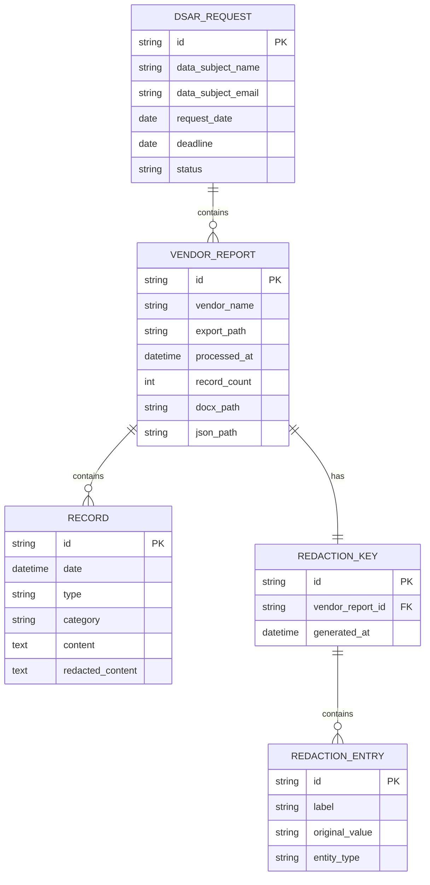

# DSAR Toolkit Implementation Plan

**Type:** Feature Implementation
**Priority:** High
**Complexity:** A LOT (Comprehensive)
**Date:** 2025-12-09

---

## Overview

Build a comprehensive DSAR (Data Subject Access Request) toolkit for GDPR/CCPA compliance that processes data exports from 80+ vendor platforms and generates compliant response packages with proper third-party redaction.

### Key Deliverables
- Core Python modules (redaction, document generation, utilities)
- 26 Phase 1 vendor processors
- Package compilation script
- Automated test suite
- Documentation

---

## Problem Statement

Organizations face significant challenges responding to GDPR Article 15 data subject access requests:

1. **Manual Processing Costs**: Average manual DSAR costs $1,524 per request
2. **Volume Growth**: DSAR volumes increased 72% since 2021
3. **Multi-System Fragmentation**: Personal data scattered across 80+ vendor platforms
4. **Third-Party Redaction**: Article 15(4) requires protecting other individuals' privacy
5. **Time Constraints**: 30-day response deadline (GDPR), 45-day (CCPA)

Automation can reduce compliance workload by 85-97%.

---

## Proposed Solution

A modular Python toolkit with:
- **Shared core modules** for consistency across all vendors
- **Vendor-specific processors** following a template pattern
- **CLI interface** for scriptable automation
- **Dual output formats** (Word for humans, JSON for machines)
- **GDPR-compliant cover letters** with Article 15 disclosures

---

## Technical Approach

### Architecture

```
dsar_toolkit/
├── scripts/
│   ├── core/                    # Shared modules
│   │   ├── __init__.py
│   │   ├── redaction.py         # RedactionEngine class
│   │   ├── docgen.py            # Word document generation
│   │   ├── utils.py             # Common utilities
│   │   └── audit.py             # Audit trail logging (NEW)
│   │
│   ├── communication/           # 11 vendors
│   ├── hr_people/               # 9 vendors
│   ├── crm_sales/               # 8 vendors
│   ├── support/                 # 10 vendors
│   ├── project_mgmt/            # 10 vendors
│   ├── documentation/           # 8 vendors
│   ├── marketing/               # 9 vendors
│   ├── finance/                 # 9 vendors
│   ├── devtools/                # 9 vendors
│   ├── security_it/             # 7 vendors
│   ├── recruiting/              # 6 vendors
│   ├── learning/                # 4 vendors
│   ├── surveys/                 # 6 vendors
│   ├── generic/                 # Fallback processors
│   └── compile_package.py       # Final DSAR assembly
│
├── templates/                   # Document templates
├── exports/                     # User export files (input)
├── output/                      # Generated reports (output)
│   └── internal/                # Redaction keys (DO NOT SEND)
├── tests/                       # Test suite
├── config.json                  # Organization settings
├── requirements.txt
├── pyproject.toml
└── README.md
```

### Implementation Phases

#### Phase 1: Foundation (Core Modules)

**Tasks:**
- [ ] Create directory structure
- [ ] Implement `core/redaction.py` with RedactionEngine class
- [ ] Implement `core/docgen.py` with report generation functions
- [ ] Implement `core/utils.py` with CLI and file utilities
- [ ] Implement `core/audit.py` for compliance tracking (enhancement)
- [ ] Create `config.json` for organization settings
- [ ] Write unit tests for core modules
- [ ] Create `requirements.txt` and `pyproject.toml`

**Files to create:**

```python
# scripts/core/__init__.py
from .redaction import RedactionEngine
from .docgen import create_vendor_report, create_cover_letter, create_redaction_key
from .utils import setup_argparser, load_json, load_csv, extract_zip, save_json
```

```python
# scripts/core/redaction.py
"""
Shared redaction logic for all DSAR processors.

Key features:
- Data subject detection (by name, email, user ID)
- Consistent placeholder labeling ([REDACTED_USER_1], etc.)
- Longest-match-first replacement algorithm
- Reverse mapping for audit purposes
"""

import re
from typing import Dict, List, Set, Optional

class RedactionEngine:
    def __init__(self, data_subject_name: str, data_subject_email: str = None):
        self.ds_name = data_subject_name
        self.ds_email = data_subject_email
        self.ds_name_parts = set(p.lower() for p in data_subject_name.split() if len(p) > 2)

        self.redaction_map: Dict[str, str] = {}
        self.reverse_map: Dict[str, str] = {}

        self.counters = {
            'user': 0, 'bot': 0, 'email': 0,
            'external': 0, 'phone': 0, 'id': 0
        }

    def is_data_subject(self, name: str = None, email: str = None, user_id: str = None) -> bool:
        """Check if identifier belongs to the data subject."""
        # Implementation per project plan
        pass

    def add_user(self, user_id: str, name: str = None, email: str = None,
                 is_bot: bool = False) -> Optional[str]:
        """Add user to redaction map. Returns label or None if data subject."""
        pass

    def add_external(self, name: str) -> str:
        """Add external name not in system user list."""
        pass

    def add_email(self, email: str) -> Optional[str]:
        """Add email to redaction map."""
        pass

    def redact(self, text: str) -> str:
        """Apply all redactions. Longest patterns first."""
        pass

    def get_redaction_key(self) -> Dict[str, str]:
        """Return reverse map for audit."""
        pass

    def get_stats(self) -> Dict[str, int]:
        """Return redaction statistics."""
        pass
```

**Success Criteria:**
- [ ] All core modules pass unit tests
- [ ] RedactionEngine correctly identifies data subject
- [ ] RedactionEngine consistently labels third parties
- [ ] Document generation produces valid .docx files
- [ ] Utility functions handle JSON, CSV, ZIP formats

#### Phase 2: First Vendor Implementations

**Priority Order (26 vendors):**

| # | Vendor | Category | Complexity | Notes |
|---|--------|----------|------------|-------|
| 1 | Slack | Communication | Easy | Multi-file export (users.json, channels/, messages/) |
| 2 | HubSpot | CRM | Easy | JSON export with contacts, deals, activities |
| 3 | Zendesk | Support | Easy | JSON/CSV export with tickets, comments |
| 4 | Jira | Project Mgmt | Easy | JSON export with issues, comments |
| 5 | CharlieHR | HR | Easy | CSV export with employee data |
| 6 | compile_package.py | Core | Easy | Aggregates all vendor outputs |
| 7 | Salesforce | CRM | Easy | Large JSON exports |
| 8 | Notion | Documentation | Medium | Nested page structure |
| 9 | GitHub | DevTools | Medium | Activity, commits, issues, PRs |
| 10 | Asana | Project Mgmt | Easy | JSON export |
| 11 | Intercom | Support | Easy | JSON export with conversations |
| 12 | BambooHR | HR | Easy | CSV export |
| 13 | Greenhouse | Recruiting | Easy | JSON export with applications |
| 14 | Mailchimp | Marketing | Easy | JSON export with campaigns, subscribers |
| 15 | Stripe | Finance | Easy | JSON with transactions, customers |
| 16 | Okta | Security | Easy | JSON with login history |
| 17 | Trello | Project Mgmt | Easy | JSON export |
| 18 | Monday.com | Project Mgmt | Easy | JSON export |
| 19 | Pipedrive | CRM | Easy | JSON export |
| 20 | Freshdesk | Support | Easy | JSON export |
| 21 | Google Workspace | Communication | Medium | Multi-service (Gmail, Drive, Calendar) |
| 22 | Microsoft 365 | Communication | Medium | Multi-service (Outlook, OneDrive, Teams) |
| 23 | GitLab | DevTools | Medium | Similar to GitHub |
| 24 | Confluence | Documentation | Medium | Page structure, comments |
| 25 | generic_csv_dsar.py | Generic | Easy | Fallback for unknown CSV |
| 26 | generic_json_dsar.py | Generic | Easy | Fallback for unknown JSON |

**Vendor Script Template:**

```python
#!/usr/bin/env python3
"""
{VENDOR} DSAR Processor

Export source: {HOW TO GET EXPORT FROM VENDOR}
Format: {JSON/CSV/ZIP}

Usage:
    python {vendor}_dsar.py export.{ext} "John Smith" --email john@company.com
"""

import sys
import os
from datetime import datetime

sys.path.insert(0, os.path.dirname(os.path.dirname(os.path.abspath(__file__))))

from core.redaction import RedactionEngine
from core.docgen import create_vendor_report
from core.utils import (
    setup_argparser, parse_extra_redactions, load_json, load_csv,
    extract_zip, save_json, ensure_output_dir, safe_filename, format_date
)

VENDOR_NAME = "{Vendor Name}"

def find_data_subject(data: dict, name: str, email: str = None) -> dict:
    """Locate data subject in export."""
    # Vendor-specific implementation
    pass

def extract_users(data: dict) -> dict:
    """Extract all users for redaction mapping."""
    pass

def extract_profile(data_subject: dict) -> dict:
    """Extract profile data for data subject."""
    pass

def extract_records(data: dict, data_subject_id: str) -> list:
    """Extract all records for data subject."""
    pass

def process(export_path: str, data_subject_name: str,
            data_subject_email: str = None, extra_redactions: list = None,
            output_dir: str = './output'):
    """Main processing function."""

    ensure_output_dir(output_dir)
    ensure_output_dir(os.path.join(output_dir, 'internal'))

    # 1. Load export (vendor-specific)
    data = load_json(export_path)

    # 2. Find data subject
    data_subject = find_data_subject(data, data_subject_name, data_subject_email)
    if not data_subject:
        raise ValueError(f"Data subject '{data_subject_name}' not found in export")

    # 3. Build redaction engine
    engine = RedactionEngine(data_subject_name, data_subject_email)

    # 4. Add all users to redaction map
    users = extract_users(data)
    for user_id, user_info in users.items():
        engine.add_user(user_id, user_info.get('name'), user_info.get('email'))

    # 5. Add extra redactions
    for name in (extra_redactions or []):
        engine.add_external(name)

    # 6. Extract profile and records
    profile = extract_profile(data_subject)
    records = extract_records(data, data_subject.get('id'))

    # 7. Apply redaction to records
    redacted_records = []
    for record in records:
        redacted = record.copy()
        if 'content' in redacted:
            redacted['content'] = engine.redact(str(redacted['content']))
        redacted_records.append(redacted)

    # 8. Generate outputs
    safe_name = safe_filename(data_subject_name)
    timestamp = datetime.now().strftime('%Y%m%d_%H%M%S')

    # Word document
    doc = create_vendor_report(
        vendor_name=VENDOR_NAME,
        data_subject_name=data_subject_name,
        data_subject_email=data_subject_email,
        profile_data=profile,
        records=redacted_records,
        redaction_stats=engine.get_stats(),
        export_filename=os.path.basename(export_path)
    )
    docx_path = os.path.join(output_dir, f"{VENDOR_NAME}_DSAR_{safe_name}_{timestamp}.docx")
    doc.save(docx_path)

    # JSON export
    json_data = {
        'vendor': VENDOR_NAME,
        'data_subject': data_subject_name,
        'email': data_subject_email,
        'generated': datetime.now().isoformat(),
        'profile': profile,
        'records': redacted_records,
        'record_count': len(redacted_records)
    }
    json_path = os.path.join(output_dir, f"{VENDOR_NAME}_DSAR_{safe_name}_{timestamp}.json")
    save_json(json_data, json_path)

    # Redaction key (INTERNAL - separate directory)
    key_path = os.path.join(output_dir, 'internal', f"{VENDOR_NAME}_REDACTION_KEY_{safe_name}_{timestamp}.json")
    save_json(engine.get_redaction_key(), key_path)

    print(f"✓ {VENDOR_NAME}: {len(redacted_records)} records processed")
    print(f"  → {docx_path}")
    print(f"  → {json_path}")

    return docx_path, json_path

if __name__ == '__main__':
    parser = setup_argparser(VENDOR_NAME)
    args = parser.parse_args()

    try:
        process(
            export_path=args.export_path,
            data_subject_name=args.data_subject_name,
            data_subject_email=args.email,
            extra_redactions=parse_extra_redactions(args.redact),
            output_dir=args.output
        )
    except Exception as e:
        print(f"Error: {e}")
        sys.exit(1)
```

#### Phase 3: Package Compilation

**compile_package.py specification:**

```python
#!/usr/bin/env python3
"""
Compile complete DSAR package from vendor reports.

Usage:
    python compile_package.py output/ "John Smith" \
        --email john@company.com \
        --request-date "2025-01-15" \
        --company "Acme Corp" \
        --dpo-name "Jane Doe" \
        --dpo-email "dpo@acme.com"

Output:
    Creates password-protected ZIP containing:
    - 00_COVER_LETTER.docx
    - 01_Slack_DSAR_Report.docx
    - 02_HubSpot_DSAR_Report.docx
    - ...
    - json_exports/
        - Slack_export.json
        - HubSpot_export.json
        - ...
    - manifest.json (list of included files)
"""
```

**Key Functions:**
- Discover all vendor reports in output directory
- Calculate aggregate statistics
- Generate GDPR-compliant cover letter
- Create structured ZIP package
- Generate manifest for contents

#### Phase 4: Testing & Documentation

**Test Structure:**

```
tests/
├── unit/
│   ├── test_redaction.py       # RedactionEngine tests
│   ├── test_docgen.py          # Document generation tests
│   └── test_utils.py           # Utility function tests
├── integration/
│   ├── test_slack_processor.py
│   ├── test_compile_package.py
│   └── test_end_to_end.py
├── fixtures/
│   └── sample_exports/         # Synthetic test data
│       ├── slack_export.zip
│       ├── hubspot_export.json
│       └── ...
└── conftest.py                 # Shared pytest fixtures
```

**Test Data Generation:**
- Use Faker library for synthetic user/company data
- Create JSON templates matching real vendor structures
- No real customer data in tests

---

## Critical Questions Requiring Answers

### Must Answer Before Implementation

**Q1: Data Subject Identification - Ambiguous Matches**
When multiple users match the data subject name (e.g., two "John Smith" employees), how should the script behave?
- **A)** Raise error listing all matches, require disambiguating email (Recommended)
- **B)** Take first match with warning
- **C)** Make email mandatory
- **D)** Interactive selection prompt

**Q2: Redaction Key Security**
How should internal redaction keys be protected?
- **A)** Separate `./output/internal/` directory with README warning (Recommended)
- **B)** Password-protected file
- **C)** Encrypted storage
- **D)** Store outside output directory

**Q3: Final Package Format**
What is the output format of compile_package.py?
- **A)** Structured ZIP with manifest (Recommended)
- **B)** Flat folder
- **C)** Single merged PDF
- **D)** Password-protected ZIP

**Q4: Large Export Handling**
How to handle exports larger than available RAM?
- **A)** Document 16GB minimum, fail gracefully with message (Recommended for v1)
- **B)** Implement streaming parser
- **C)** Chunk processing
- **D)** Require pre-filtering

**Q5: Cross-Vendor Redaction Consistency**
Should same person have consistent labels across all vendors?
- **A)** Accept inconsistency, document in cover letter (Recommended for v1)
- **B)** Global pre-processing step
- **C)** Post-processing normalization

**Q6: CCPA Scope**
Should CCPA have separate templates?
- **A)** GDPR-only for v1, CCPA in v2 (Recommended)
- **B)** Combined template with conditional sections
- **C)** Separate templates

---

## Identified Gaps & Edge Cases

### Critical (Must Address)

| Gap | Description | Mitigation |
|-----|-------------|------------|
| Ambiguous name matches | Two "John Smith" in export | Require email if multiple matches |
| Redaction key exposure | Internal file sent to data subject | Separate `internal/` directory |
| Memory exhaustion | 10GB+ exports crash | Document requirements, graceful error |
| Multi-file exports | Slack has 5+ JSON files | Vendor-specific file orchestration |
| Same name, different person | John Smith x2 get same label? | Use user_id as primary key |

### Important (Should Address)

| Gap | Description | Mitigation |
|-----|-------------|------------|
| Partial failures | Vendor 7 of 12 fails | Continue processing, collect errors |
| Filename collisions | Re-running overwrites | Add timestamp to filenames |
| HTML in content | Raw HTML unreadable | Strip tags, html.unescape() |
| Timezone differences | UTC vs local confusion | Preserve original, document in report |
| Progress indication | Large exports appear hung | Print progress every 1000 records |

### Nice-to-Have (Future Enhancement)

| Gap | Description | Future Version |
|-----|-------------|----------------|
| Streaming large files | Memory-efficient parsing | v2.0 |
| Global redaction map | Consistent labels cross-vendor | v2.0 |
| NER auto-detection | Auto-find names via NLP | v2.0 |
| Multi-language templates | French, German cover letters | v2.0 |
| Web UI | Upload/download interface | v3.0 |

---

## Acceptance Criteria

### Functional Requirements

- [ ] Process exports from 26 Phase 1 vendors
- [ ] Correctly identify data subject by name and/or email
- [ ] Redact all third-party names with consistent placeholders
- [ ] Generate Word reports with profile data and activity records
- [ ] Generate JSON exports for machine readability
- [ ] Generate internal redaction key for audit
- [ ] Compile multi-vendor package with cover letter
- [ ] Handle ZIP, JSON, and CSV input formats

### Non-Functional Requirements

- [ ] Process typical DSAR (1000 records) in < 5 minutes
- [ ] Memory usage < 8GB for exports under 1GB
- [ ] Clear error messages for common failures
- [ ] Timestamp in all output filenames
- [ ] Redaction keys stored separately from deliverables

### Quality Gates

- [ ] Unit test coverage > 80% for core modules
- [ ] Integration tests for each vendor processor
- [ ] No hardcoded paths or credentials
- [ ] All dependencies pinned in requirements.txt
- [ ] README with setup and usage instructions

---

## Success Metrics

| Metric | Target | Measurement |
|--------|--------|-------------|
| Vendor coverage | 26 vendors (Phase 1) | Count of working processors |
| Processing speed | < 5 min typical DSAR | Benchmark with test data |
| Redaction accuracy | 100% third-party names | Manual review of samples |
| Error rate | < 5% failed processing | Track errors in testing |
| Test coverage | > 80% core modules | pytest --cov report |

---

## Dependencies & Prerequisites

### Python Dependencies

```txt
# requirements.txt
python-docx>=1.0.0
pandas>=2.0.0
python-dateutil>=2.8.2
chardet>=5.0.0
openpyxl>=3.1.0
pytest>=8.0.0
pytest-cov>=4.0.0
faker>=20.0.0  # For test data generation
tqdm>=4.66.0   # For progress bars (optional)
```

### System Requirements

- Python 3.9+
- 8GB RAM minimum (16GB recommended for large exports)
- 10GB disk space for processing

### External Dependencies

- Vendor platform admin access to export data
- Data subject identity verification (manual process)

---

## Risk Analysis & Mitigation

| Risk | Likelihood | Impact | Mitigation |
|------|------------|--------|------------|
| Vendor export format changes | Medium | High | Schema validation, graceful degradation |
| Memory exhaustion on large exports | Medium | High | Document requirements, streaming in v2 |
| Accidental redaction key disclosure | Low | Critical | Separate directory, clear naming |
| Incomplete third-party redaction | Low | High | Multiple redaction passes, manual review |
| Missed 30-day deadline | Medium | Medium | Automation reduces processing time |

---

## Future Considerations

### Version 2.0

- Streaming parser for large exports
- Global redaction map across vendors
- Microsoft Presidio integration for NER
- CCPA-specific templates
- Progress bars with ETA

### Version 3.0

- Web UI for non-technical users
- Automated vendor export retrieval via API
- Integration with legal case management
- Multi-language template support

---

## ERD: Core Data Model



---

## References & Research

### Internal References

- Project plan: `DSAR_TOOLKIT_PROJECT_PLAN_V2.md`
- No existing code (greenfield project)

### External References

- [GDPR Article 15 - Right of Access](https://gdpr-info.eu/art-15-gdpr/)
- [GDPR Article 15(4) - Third-Party Protection](https://gdpr-info.eu/art-15-gdpr/)
- [python-docx Documentation](https://python-docx.readthedocs.io/)
- [Microsoft Presidio - PII Detection](https://microsoft.github.io/presidio/)
- [DSAR Compliance Best Practices 2025](https://www.redactable.com/blog/what-is-dsar)

### Industry Standards

- GDPR 30-day response requirement (Article 12(3))
- CCPA 45-day response requirement
- UK DUAA "reasonable and proportionate" standard

---

## MVP Scope

For initial implementation, focus on:

1. **Core modules** (redaction, docgen, utils)
2. **5 vendor processors** (Slack, HubSpot, Zendesk, Jira, CharlieHR)
3. **compile_package.py** with basic cover letter
4. **Unit tests** for core modules
5. **README** with setup instructions

This delivers a functional toolkit that can be expanded to remaining vendors incrementally.

---

*Plan created: 2025-12-09*
*Research agents: repo-research-analyst, best-practices-researcher, framework-docs-researcher, spec-flow-analyzer*
